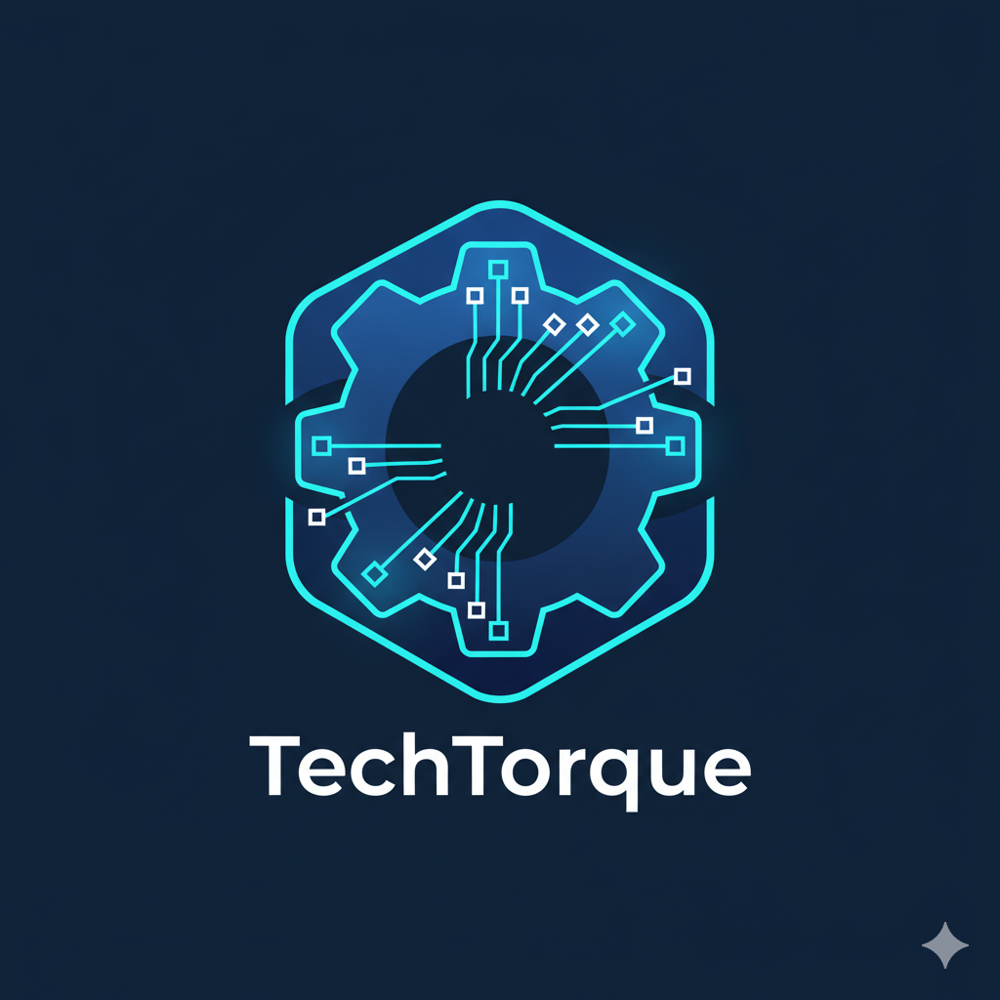
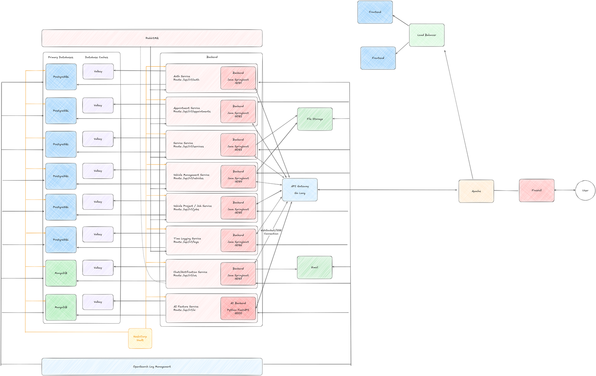

# TechTorque 2025



**The future of automobile service and appointment management.**

 -blue?style=for-the-badge) 

---

## Build status for the main repositories

[](https://github.com/TechTorque-2025/Vehicle_Service/actions/workflows/buildtest.yaml)

[](https://github.com/TechTorque-2025/Time_Logging_Service/actions/workflows/buildtest.yaml)

[](https://github.com/TechTorque-2025/Project_Service/actions/workflows/buildtest.yaml)

[](https://github.com/TechTorque-2025/Payment_Service/actions/workflows/buildtest.yaml)

[](https://github.com/TechTorque-2025/Authentication/actions/workflows/buildtest.yaml)

[](https://github.com/TechTorque-2025/Appointment_Service/actions/workflows/buildtest.yaml)

[](https://github.com/TechTorque-2025/Admin_Service/actions/workflows/buildtest.yaml)

[](https://github.com/TechTorque-2025/API_Gateway/actions/workflows/buildtest.yaml)

[](https://github.com/TechTorque-2025/Frontend_Web/actions/workflows/buildtest.yaml)

---

## Technology Stack

   

   

---

Welcome to the central repository for the **TechTorque 2025** project.

This project is a modern, enterprise-grade web application designed to digitize and streamline the operations of an automobile service company.

## 🏛️ System Architecture



The project is built on a **polyglot microservices architecture**. This design provides scalability, resilience, and technological flexibility, allowing each component to use the best tool for its specific job.

- **💻 Frontend Web App:** A [Next.js](https://nextjs.org/) and TypeScript application serving both customers and employees.
- **🌐 API Gateway:** A single entry point written in Go, responsible for routing, authentication (JWT validation), and rate limiting.
- **⚙️ Backend Microservices:** A suite of independent [Spring Boot](https://spring.io/projects/spring-boot) services, each with its own dedicated PostgreSQL database, handling specific business domains.
- **🗄️ Databases:** A mix of [PostgreSQL](https://www.postgresql.org/) for transactional data and [MongoDB](https://www.mongodb.com/) for semi-structured data like notifications and chat logs.

For a complete architectural overview, please see the `EAD TechTorque.pdf` design document.

## 🚀 Getting Started: The All-in-One Development Environment

The entire TechTorque ecosystem is orchestrated using Docker Compose. This allows any developer to build and run all containers with a single command.

### ✅ Prerequisites

- [Docker](https://www.docker.com/get-started) & [Docker Compose](https://docs.docker.com/compose/install/)
- A Java 17+ JDK
- Node.js & npm
- Go language

### ▶️ Running the Full System

1. **Clone this repository.**
2. **Navigate to the project root** (where this `README.md` and `docker-compose.yml` are located).
3. **Run the Docker Compose command:**

```bash
# To start all services and watch for code changes (recommended for development)
docker-compose watch
```

or

```bash
# To start all services in the background without hot-reloading
docker-compose up --build -d
```

This command will build, create, and start all containers.

### Accessing the System

- **API Gateway:** `http://localhost:8080`
- **Frontend Application:** `http://localhost:3000` (after running `npm run dev` in the `Frontend_Web` directory)
- **Individual Service Docs:** `http://localhost:[PORT]/swagger-ui.html` (e.g., `http://localhost:8081/swagger-ui.html` for the Auth Service)

## 🧩 Repository Structure

Each major component of the system resides in its own top-level directory. Please refer to the `README.md` file within each directory for specific details about that service.

## 🧑‍💻 Development Team

| Name | Role | GitHub |
|---|---:|---|
| Randitha (B.H.A.R. Kulasekera) | Group Leader / Project Architect / Full Stack Developer / DevOps | [RandithaK](https://github.com/RandithaK) |
| Suweka | Full Stack Developer | [Suweka](https://github.com/Suweka) |
| Akith | Full Stack Developer | [Akith-002](https://github.com/Akith-002) |
| Pramudi | Full Stack Developer | [Pramudi02](https://github.com/Pramudi02) |
| Aditha | Full Stack Developer | [AdithaBuwaneka](https://github.com/AdithaBuwaneka) |
| Chamodi | Full Stack Developer | [ChamodiSandunika](https://github.com/ChamodiSandunika) |
| Dhanuja | Full Stack Developer / Project Manager | [Dhanuja416](https://github.com/Dhanuja416) |
| Mahesh | Full Stack Developer | [TharinduMahesh](https://github.com/TharinduMahesh) |
| Rothila | Full Stack Developer / Frontend Designer | [mehara-rothila](https://github.com/mehara-rothila) |
| Dinith | Full Stack Developer | [DinithEdirisinghe](https://github.com/DinithEdirisinghe) |

---
© 2025 TechTorque
